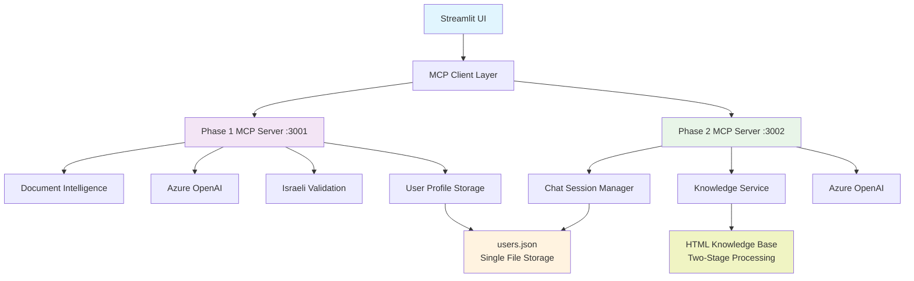
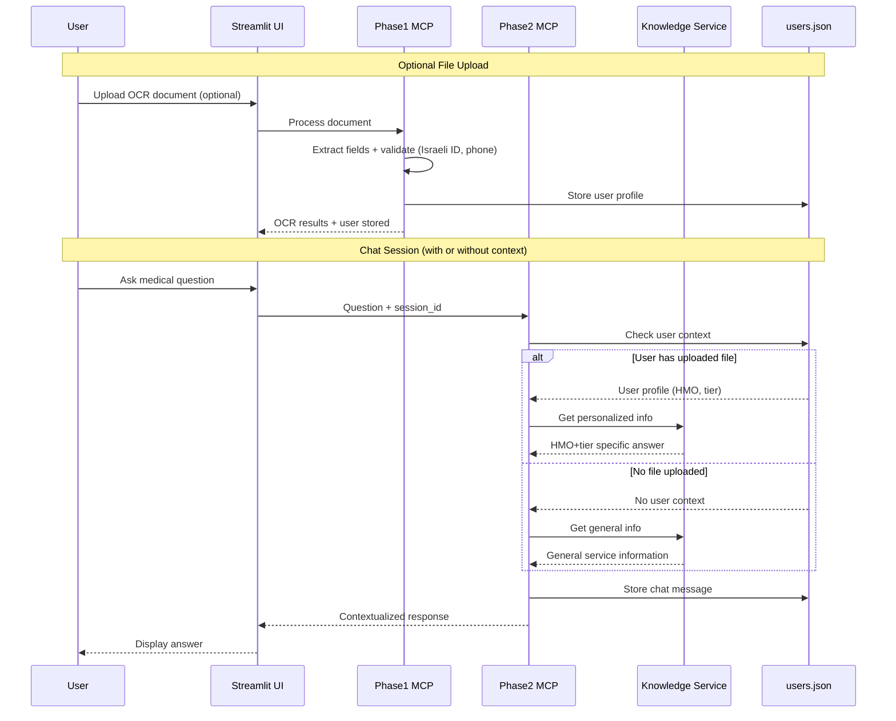

# GenAI OCR Chatbot - Project Submission

## Project Overview

This project implements a two-phase GenAI system for document processing and medical services chatbot using Azure OpenAI services. The solution includes:

1. **Phase 1**: OCR-based field extraction from National Insurance Institute forms
2. **Phase 2**: Microservice-based chatbot for medical services Q&A

## Architecture Overview



## Project Structure

```
genai-ocr-chatbot/
├── README.md                    # Original assignment requirements
├── submission_readme.md         # This file
├── run.py                      # Main runner script (starts MCP servers + UI)
├── requirements.txt            # Python dependencies
├── .env                        # Azure credentials
│
├── services/                    # MCP Servers
│   ├── phase1_server.py        # OCR MCP Server (includes validation)
│   ├── phase2_server.py        # Chat MCP Server
│   └── shared_utils.py         # Common Azure client + utilities
│
├── src/
│   ├── ui/                     # Streamlit UI (existing, preserved)
│   │   ├── __init__.py
│   │   ├── streamlit_app.py    # Main UI application
│   │   ├── phase1_ui.py        # OCR interface
│   │   └── phase2_ui.py        # Chatbot interface
│   │
│   └── knowledge_service.py    # Two-stage knowledge service
│
├── data/
│   ├── phase1_data/            # OCR documents
│   │   ├── 283_ex1.pdf
│   │   ├── 283_ex2.pdf
│   │   ├── 283_ex3.pdf
│   │   └── 283_raw.pdf
│   ├── phase2_data/            # HTML knowledge base
│   │   ├── alternative_services.html
│   │   ├── communication_clinic_services.html
│   │   ├── dentel_services.html
│   │   ├── optometry_services.html
│   │   ├── pragrency_services.html
│   │   └── workshops_services.html
│   ├── users.json              # Single user storage file
│   ├── uploads/                # Temporary file uploads
│   └── mock_responses/         # Mock data for testing
│       ├── phase1_mock.json
│       └── phase2_mock.json
│
├── logs/                       # MCP Server logs
│   ├── phase1/                 # Phase 1 MCP server logs
│   └── phase2/                 # Phase 2 MCP server logs
│
├── config/
│   └── settings.py            # Application settings
│
├── tests/
│   ├── test_phase1.py
│   └── test_phase2.py
│
└── legacy/
    └── UI/                    # Original unrelated UI (moved)
```

## User Flow: File-Driven Context



## Mock Data Implementation

For the initial demo phase, the system uses mock responses to simulate Azure OpenAI interactions:

### Phase 1 Mock Data
- Simulated OCR extraction results for National Insurance forms
- Pre-defined JSON responses matching the required schema
- Mock validation responses

### Phase 2 Mock Data
- Simulated user information collection conversations
- Pre-scripted Q&A responses based on knowledge base
- Mock HMO service information

## Component Details

### Core Components

1. **Azure Client (`src/shared/azure_client.py`)**
   - Manages Azure OpenAI connections
   - Handles authentication and API calls
   - Switches between real and mock responses

2. **OCR Service (`src/phase1/ocr_service.py`)**
   - Integrates with Azure Document Intelligence
   - Processes PDF/JPG uploads
   - Extracts structured data using LLM

3. **Chatbot Service (`src/phase2/chatbot_service.py`)**
   - Stateless microservice architecture
   - Manages conversation flow
   - Handles Hebrew/English multilingual support

4. **Knowledge Base (`src/phase2/knowledge_base.py`)**
   - Parses HTML medical service data
   - Enables semantic search across content
   - Supports HMO-specific information retrieval

### UI Components

- **Main App**: Streamlit-based interface with tabs for both phases
- **Phase 1 UI**: File upload, processing status, JSON display
- **Phase 2 UI**: Chat interface with user information collection

## Running the Application

### Prerequisites
```bash
pip install -r requirements.txt
```

### Start the Application
```bash
python run.py
```

This will launch the Streamlit interface accessible at `http://localhost:8501`

### Mock Mode vs Production Mode

The application supports both mock and production modes:

- **Mock Mode** (default): Uses pre-defined responses for demonstration
- **Production Mode**: Requires Azure OpenAI credentials and connects to real services

## Key Features

### Phase 1 Features
- Multi-format document support (PDF, JPG)
- Hebrew and English form processing
- Structured JSON extraction
- Field validation and error handling
- Mock OCR responses for testing

### Phase 2 Features
- Stateless microservice design
- Multi-user concurrent support
- Hebrew/English conversation support
- HMO-specific service information
- Knowledge base integration
- Client-side session management

## Development Phases

### Current Phase: Mock Implementation
- [x] Project structure setup
- [x] Mock data creation
- [x] Basic UI framework
- [ ] Phase 1 mock responses
- [ ] Phase 2 mock conversations
- [ ] Integration testing

### Next Phase: Azure Integration
- [ ] Azure OpenAI client implementation
- [ ] Document Intelligence integration
- [ ] Real-time processing
- [ ] Error handling and logging
- [ ] Performance optimization

### Final Phase: Production Ready
- [ ] Comprehensive testing
- [ ] Documentation
- [ ] Deployment configuration
- [ ] Monitoring and analytics
- [ ] Security hardening

## Technology Stack

- **Backend**: Python, FastAPI (for microservice), Streamlit (for UI)
- **AI Services**: Azure OpenAI (GPT-4o, GPT-4o Mini), Azure Document Intelligence, ADA 002
- **Frontend**: Streamlit with custom components
- **Data Processing**: Native Python libraries (no LangChain)
- **Knowledge Base**: HTML parsing and processing

## Notes

1. This implementation follows the assignment requirements strictly
2. Uses only native Azure OpenAI SDK (no LangChain)
3. Designed for scalability and concurrent user support
4. Implements proper error handling and validation
5. Supports both Hebrew and English languages
6. Maintains stateless architecture for microservice compatibility