# GenAI OCR Chatbot - Microservices Production Submission

## Overview

This solution implements a **true microservices architecture** for the GenAI Developer Assessment, featuring **stateless services**, **horizontal scalability**, and **Azure-native integrations**.

### Key Architecture Decisions ✅

- **Microservices Separation**: OCR service, Metrics service, and UI as independent components
- **NGINX Load Balancer**: L7 reverse proxy for service routing and scaling
- **SQLite WAL Analytics**: Single writer, multiple readers for metrics aggregation
- **Stateless Design**: Each service instance handles any request independently
- **Azure-Native**: Document Intelligence v4 + Azure OpenAI SDK only

---

## Architecture: Production Microservices


### Microservices Design Principles 🏗️

1. **Service Separation**: Each service has single responsibility (OCR vs Analytics)
2. **Stateless Processes**: No server-side sessions, any instance handles any request
3. **Load Balancer Routing**: NGINX distributes traffic across service pools
4. **External State Management**: Only metrics service maintains state (SQLite WAL)
5. **Horizontal Scaling**: Add instances without coordination

---

## Project Structure

```
genai-ocr-chatbot/
├── README.md                          # Original assignment requirements
├── submission_readme.md               # This file
├── requirements.txt                   # Global dependencies
├── .env                              # Azure credentials
│
├── scripts/                          # 🚀 DEVELOPMENT SCRIPTS
│   ├── start-dev.sh                  # Start all services locally
│   ├── stop-dev.sh                   # Stop all services
│   └── build-all.sh                  # Build containers (future)
│
├── services/                         # 🔧 MICROSERVICES
│   ├── shared/                       # Common utilities
│   │   ├── telemetry/emit.py         # Metrics emission client
│   │   ├── validation/israeli_validators.py
│   │   └── config/settings.py
│   │
│   ├── ocr-service/                  # 📄 OCR MICROSERVICE
│   │   ├── app/
│   │   │   ├── main.py               # Flask app factory
│   │   │   ├── routes/
│   │   │   │   ├── extract.py        # POST /api/ocr/extract
│   │   │   │   └── health.py         # GET /api/ocr/health
│   │   │   ├── services/
│   │   │   │   └── ocr_pipeline.py   # Pure stateless OCR functions
│   │   │   └── clients/
│   │   │       ├── azure_di.py       # Document Intelligence
│   │   │       └── azure_openai.py   # OpenAI client
│   │   └── run.py                    # Local development runner
│   │
│   └── metrics-service/              # 📊 ANALYTICS MICROSERVICE (SINGLETON)
│       ├── app/
│       │   ├── main.py               # Flask app factory
│       │   ├── routes/
│       │   │   ├── ingest.py         # POST /api/metrics/ingest
│       │   │   ├── analytics.py      # GET /api/metrics/*, /api/analytics/*
│       │   │   └── health.py         # Health checks
│       │   └── services/
│       │       ├── storage.py        # SQLite WAL operations
│       │       └── analytics.py      # Aggregation queries
│       ├── data/metrics.db           # SQLite database (auto-created)
│       └── run.py                    # Local development runner
│
├── ui/                               # 🖥️ STREAMLIT FRONTEND
│   ├── streamlit_app.py              # Main UI
│   ├── pages/
│   │   ├── phase1.py                 # OCR interface → calls OCR service
│   │   └── analytics.py              # Metrics dashboard with Plotly
│   └── clients/api_client.py         # HTTP client for microservices
│
├── nginx/                            # 🌐 LOAD BALANCER
│   └── sites-available/api.conf      # Service routing configuration
│
├── docker/                           # 🐳 CONTAINERIZATION (FUTURE)
│   └── docker-compose.yml            # Multi-service orchestration
│
├── data/phase1_data/                 # 📁 TEST DOCUMENTS
└── logs/                            # 📋 SERVICE LOGS
    ├── ocr-service/
    ├── metrics-service/
    └── nginx/
```

---

## API Specifications

### **OCR Service** 📄
**Base URL**: `http://localhost:8080/api/ocr/`

#### `POST /extract`
- **Input**: `multipart/form-data` with `file`, optional `language`/`format`
- **Output**: Assignment JSON schema + validation + confidence metrics
- **Features**: Israeli ID/phone validation, OCR error correction, cost tracking

#### `GET /health`
- **Output**: Service health + Azure connectivity status

### **Metrics Service** 📊
**Base URL**: `http://localhost:8080/api/metrics/`

#### `POST /ingest`
- **Input**: Service telemetry events (internal use)
- **Purpose**: Aggregate metrics from all OCR service instances

#### `GET /analytics/confidence`
- **Output**: Confidence distribution data (bins: <70%, 70-89%, 90%+)

#### `GET /analytics/trends`
- **Output**: Processing time trends, error rates over time

#### `GET /metrics`
- **Output**: Current counters, success rates, cost estimates

---

### **Chat Service (Phase 2)** 💬
Base URL: `http://localhost:8000` (direct) or via NGINX `http://localhost:8080/api/chat/` if routed

Endpoints (stateless - client sends full context every turn):
- `GET /health`: health check
- `GET /v1/chat/info`: capabilities and constraints
- `POST /v1/chat/turn` (recommended single endpoint)
  - Input:
    - `message` (user text)
    - `language` (`he` | `en`) → model answers in same language
    - `user_profile` object: `{ fullName, idNumber(9), gender, age(0-120), hmo(מכבי|מאוחדת|כללית), hmoCardNumber(9), tier(זהב|כסף|ארד) }`
    - `conversation_history` array of `{role, content}` (client-side memory)
  - Output (unified per turn):
    - `intent` (`collection|qa|other`)
    - `answer_type` (`general_description|specific_benefits|eligibility|cost_coverage|documents_required|process_steps|other`)
    - `updated_profile`, `known_fields`, `missing_fields`
    - `sufficient_context` (boolean), `action` (`collect|answer|clarify`), `next_question`
    - Optional when answering: `answer`, `citations[]`, `token_usage`, `disclaimer`

Language & safety policy:
- The assistant responds in the same language as `message`.
- If context is partial, it provides general information and asks exactly one targeted question that includes the missing values needed for a precise answer.
- Do not fabricate non-existent offers; rely only on preprocessed HTML knowledge (“Service Information”). Use low temperature for answers.
- Add a brief non-medical-advice disclaimer.

#### Stateless KB Agent Flow

```mermaid
sequenceDiagram
  autonumber
  participant UI as Streamlit UI
  participant CS as Chat-Service (/v1/chat/turn)
  participant AN as Analyzer (GPT‑4o JSON)
  participant KB as chat-health-kb (preprocessed HTML)
  participant QA as Answerer (GPT‑4o)
  participant MS as Metrics Service

  UI->>CS: message + user_profile + conversation_history + language
  CS->>AN: Analyze (intent, answer_type, extract/merge fields)
  AN-->>CS: {updated_profile, missing_fields, sufficient?, next_question}
  alt insufficient OR gating missing
    CS->>MS: ingest telemetry (analysis)
    CS-->>UI: {updated_profile, missing_fields, action:"collect", next_question}
  else sufficient
    CS->>KB: retrieve(category, service, hmo, tier) → snippets+citations
    CS->>QA: Answer grounded on KB snippets (low temperature)
    QA-->>CS: {answer, token_usage}
    CS->>MS: ingest telemetry (analysis+answer)
    CS-->>UI: {answer, citations, updated_profile, missing_fields, action:"answer"}
  end
```



Gating by answer_type:
- `specific_benefits|eligibility|cost_coverage` require `hmo` and `tier` (age/gender may refine).
- `general_description|documents_required|process_steps` can answer without HMO/Tier.

#### Turn-by-turn examples

Example 1: first message → insufficient → ask

```mermaid
sequenceDiagram
  participant UI
  participant CS
  participant AN
  participant MS

  UI->>CS: "מה ההטבות לטיפולי שיניים?"
  CS->>AN: Analyze
  AN-->>CS: intent=qa, type=specific_benefits, missing=[hmo,tier], sufficient=false, next="באיזו קופה ומה דרגת החברות (זהב/כסף/ארד)?"
  CS->>MS: ingest
  CS-->>UI: action=collect, next_question
```


Example 2: second message → still insufficient → ask again

```mermaid
sequenceDiagram
  participant UI
  participant CS
  participant AN
  participant MS

  UI->>CS: "אני במכבי" + profile={hmo:"מכבי"}
  CS->>AN: Analyze
  AN-->>CS: updated_profile={hmo:"מכבי"}, missing=[tier], sufficient=false, next="מה דרגת החברות (זהב/כסף/ארד)?"
  CS->>MS: ingest
  CS-->>UI: action=collect, next_question
```


Example 3: second message → sufficient → answer

```mermaid
sequenceDiagram
  participant UI
  participant CS
  participant AN
  participant KB
  participant QA
  participant MS

  UI->>CS: "אני במכבי זהב" + profile={hmo:"מכבי"}
  CS->>AN: Analyze
  AN-->>CS: updated_profile={hmo:"מכבי", tier:"זהב"}, missing=[], sufficient=true, intent=qa, type=specific_benefits
  CS->>KB: retrieve Dental, fund=מכבי, plan=זהב → snippets
  CS->>QA: Answer with grounded snippets (hebrew, low temp)
  QA-->>CS: answer + usage
  CS->>MS: ingest
  CS-->>UI: action=answer, answer, citations
```


---

## Quick Start

### **Prerequisites**
```bash
# Install NGINX (Ubuntu/macOS)
sudo apt-get install nginx    # Ubuntu
brew install nginx            # macOS

# Install Python dependencies
pip install -r requirements.txt
```

### **Development Setup**

1. **Configure Azure credentials** (`.env`):
```env
AZURE_DOCUMENT_INTELLIGENCE_ENDPOINT=...
AZURE_DOCUMENT_INTELLIGENCE_KEY=...
AZURE_OPENAI_ENDPOINT=...
AZURE_OPENAI_API_KEY=...
AZURE_OPENAI_DEPLOYMENT_NAME=gpt-4o
```

2. **Start all services**:
```bash
./scripts/start-dev.sh
```

3. **Access the application**:
- **Main UI**: http://localhost:8501 (Streamlit)
- **Load Balancer**: http://localhost:8080 (NGINX)
- **OCR Service**: http://localhost:8001-8003 (Direct access)
- **Metrics Service**: http://localhost:8031 (Direct access)

4. (Optional) **Chat Service (Phase 2)**:
- Direct: http://localhost:8000
- Via NGINX (if routed as `/api/chat/`): http://localhost:8080/api/chat/

### **Manual Service Startup** (Alternative)
```bash
# Terminal 1: Metrics Service (singleton)
cd services/metrics-service && python run.py

# Terminal 2-4: OCR Service instances
cd services/ocr-service
python run.py --port 8001 &
python run.py --port 8002 &
python run.py --port 8003 &

# Terminal 5: Chat Service (single instance)
cd services/chat-service && python run.py --port 8000 &

# Terminal 5: NGINX Load Balancer
sudo nginx -c $(pwd)/nginx/sites-available/api.conf

# Terminal 6: Streamlit UI
cd ui && streamlit run streamlit_app.py
```

---

## Phase 2 Implementation TODO

- Chat microservice (`services/chat-service/`):
  - `app/main.py` (Flask app factory), `routes/chat.py` (`GET /health`, `GET /v1/chat/info`, `POST /v1/chat/turn`)
  - `services/analyzer.py` (GPT‑4o JSON controller), `services/answerer.py` (grounded answer, low temp)
  - `services/chat_health_kb.py` (preprocess HTML, indices, deterministic retrieval)
  - `utils/request_logging.py` (reuse), `requirements.txt`, `Dockerfile`, `run.py`

- UI:
  - `ui/phase2_ui.py` (promote from temp), show known/missing fields, next_question, answer, citations
  - `ui/streamlit_app.py` (import `render_phase2`), language toggle; ensure language is sent and preserved
  - `ui/api_client.py` add client for `POST /v1/chat/turn`

- Routing & ops:
  - `nginx/sites-available/api.conf` add `upstream chat_backend` and `location /api/chat/` (optional)
  - `docker/docker-compose.yml` add `chat-service` service

- Config:
  - `.env` ensure `AZURE_OPENAI_ENDPOINT`, `AZURE_OPENAI_API_KEY`, `AZURE_OPENAI_API_VERSION`, `AZURE_OPENAI_DEPLOYMENT_NAME=gpt-4o`
  - `config/settings.py` ensure `KNOWLEDGE_BASE_DIR=data/phase2_data`

- Tests:
  - API tests for `/v1/chat/turn` (collection and answer paths)
  - Unit tests for KB parser/retriever with sample HTML files

### Test from UI (Phase 2)
1) Start Chat Service and UI.
2) Open UI → Phase 2 tab.
3) Ask in Hebrew/English; observe same-language responses.
4) When partial: UI shows `missing_fields` and `next_question`; provide missing `hmo/tier`.
5) When sufficient: answer appears with citations (source file/section). Disclaimer shown.

---

## Technical Choices & Justification

### **Why Microservices?**
- **Horizontal Scaling**: Scale OCR processing independently from analytics
- **Service Independence**: OCR failures don't affect metrics collection
- **Technology Flexibility**: Each service uses optimal stack (Flask for simplicity)
- **Team Scalability**: Different teams can own different services

### **Why NGINX Load Balancer?**
- **Production-Grade**: Industry standard for Python app load balancing
- **Proxy Buffering**: Protects backend from slow clients (PDF uploads)
- **Health Checks**: Automatic failover for unhealthy service instances
- **Path Routing**: Clean API separation (`/api/ocr/`, `/api/metrics/`)

### **Why SQLite WAL for Metrics?**
- **Single Writer, Multiple Readers**: Perfect for metrics aggregation pattern
- **No Additional Infrastructure**: Embedded database, no server setup required
- **High Performance**: WAL mode supports concurrent reads with writes
- **Easy Analytics**: SQL queries for trends, distributions, aggregations

### **Why Flask over FastAPI?**
- **Simplicity**: Minimal boilerplate for straightforward REST APIs
- **Production Proven**: Excellent NGINX + Gunicorn integration
- **Team Familiarity**: Lower learning curve for maintenance
- **Sufficient Performance**: I/O bound workload (Azure API calls) suits sync model

---

## Assignment Compliance ✅

| Requirement | Implementation | Status |
|-------------|----------------|--------|
| **Stateless microservice** | Independent OCR service instances | ✅ |
| **Multiple concurrent users** | NGINX load balancer + horizontal scaling | ✅ |
| **Client-side state management** | Streamlit stores all user session data | ✅ |
| **Azure OpenAI only** | No LangChain, pure Azure SDK integration | ✅ |
| **Document Intelligence** | DI v4 with layout + KVPs + selection marks | ✅ |
| **Hebrew/English support** | Full multilingual implementation | ✅ |
| **Structured JSON output** | Exact assignment schema compliance | ✅ |
| **Accuracy validation** | Comprehensive Israeli validation + logging | ✅ |
| **Performance monitoring** | Real-time metrics with confidence tracking | ✅ |

---

## Innovation Highlights 🚀

1. **LLM Confidence Analysis**: Field-by-field confidence scoring with Israeli domain knowledge
2. **Smart OCR Corrections**: Automatic Israeli phone/ID validation with OCR fixes
3. **Production Analytics**: SQLite WAL for high-performance metrics aggregation  
4. **Interactive Analytics**: Plotly Express dashboards with confidence distributions
5. **Cost Optimization**: Azure pricing integration with usage tracking
6. **Configurable Parameters**: Environment-driven LLM settings (temperature, top_p, etc.)

---

## Future Enhancements

- **Phase 2**: Add Chat service and KB service for medical Q&A
- **Containerization**: Docker Compose for easier deployment
- **Cloud Deployment**: Azure Container Apps with autoscaling
- **Enhanced Monitoring**: Application Insights integration
- **Load Testing**: Automated performance validation

---

## Testing

### **Health Checks**
```bash
curl http://localhost:8080/api/ocr/health
curl http://localhost:8080/api/metrics/health
```

### **OCR Processing**
```bash
curl -X POST http://localhost:8080/api/ocr/extract \
  -F "file=@data/phase1_data/283_ex1.pdf" \
  -F "language=auto"
```

### **Analytics Dashboard**
Visit http://localhost:8501 → Analytics tab for interactive visualizations

This microservices architecture ensures **production readiness**, **horizontal scalability**, and **assignment compliance** while maintaining **development simplicity** and **operational excellence**.