# GenAI OCR Chatbot - Azure Medical Services Assistant

> **Azure-powered OCR and medical chatbot with stateless microservice architecture**

## 🚀 Quick Start

### 1. Install Dependencies
```bash
pip install -r requirements.txt
```

### 2. Configure Azure Credentials
```bash
# Copy environment template
cp .env.example .env

# Edit .env with your Azure credentials:
AZURE_OPENAI_ENDPOINT=https://your-resource.openai.azure.com/
AZURE_OPENAI_API_KEY=your-api-key-here
AZURE_OPENAI_DEPLOYMENT_NAME=gpt-4o
AZURE_DOCUMENT_INTELLIGENCE_ENDPOINT=https://your-resource.cognitiveservices.azure.com/
AZURE_DOCUMENT_INTELLIGENCE_KEY=your-key-here
```

### 3. Run the Demo
```bash
python start_demo.py
```

**🎯 Access the application at [http://localhost:8501](http://localhost:8501)**

### 4. Test Everything Works
```bash
python run_tests.py
```

---

## User Interface Walkthrough

### Phase 1: Smart OCR Field Extraction
- **Upload** Israeli National Insurance forms (PDF/images)
- **Extract** structured data with AI-powered confidence analysis  
- **Validate** using Israeli domain knowledge (ID numbers, cities, phones)
- **Export** in multiple formats with detailed reasoning

### Phase 2: Medical Services Chatbot
- **Ask** questions about Israeli health insurance benefits
- **Chat** in Hebrew or English with auto-detection
- **Get** personalized answers based on your HMO and tier
- **Powered** by 324 service chunks with semantic search

---

## 🏗️ Architecture

Simple microservices with direct connections for demo, designed for horizontal scaling:

```mermaid
graph TB
    UI["🖥️ Streamlit UI<br/>localhost:8501"]
    OCR["📄 OCR Service<br/>localhost:8001"]
    CHAT["💬 Chat Service<br/>localhost:5000"]
    METRICS["📊 Metrics Service<br/>localhost:8031"]
    CHROMADB["🗃️ ChromaDB<br/>324 chunks"]
    SQLITE["💾 SQLite<br/>Metrics"]
    
    UI --> OCR
    UI --> CHAT
    UI --> METRICS
    CHAT --> CHROMADB
    METRICS --> SQLITE
    
    style UI fill:#e3f2fd
    style OCR fill:#f3e5f5
    style CHAT fill:#e8f5e8
    style METRICS fill:#fff3e0
```



---

## 📁 Project Structure

```
genai-ocr-chatbot/
├── start_demo.py              # 🚀 Main demo starter
├── run_tests.py               # 🧪 Test all services
├── requirements.txt           # 📦 Dependencies
├── config/settings.py         # ⚙️ Configuration
│
├── services/                  # 🔧 Microservices
│   ├── health-form-di-service/    # OCR service (Port 8001)
│   ├── chat-service/              # Chat service (Port 5000)
│   └── metrics-service/           # Metrics service (Port 8031)
│
├── ui/                        # 🖥️ Streamlit interface (Port 8501)
│   ├── streamlit_app.py
│   ├── phase1_ui.py
│   ├── phase2_ui.py
│   └── api_client.py
│
├── data/                      # 📊 Data storage
│   ├── phase1_data/              # Test PDFs
│   ├── phase2_data/              # Knowledge base (6 categories)
│   └── chromadb_storage/         # Vector database
│
└── src/                       # 📚 Shared modules
    ├── document_models.py        # Pydantic models + validation
    └── logger_config.py          # Centralized logging
```

---

## 🔧 Technical Highlights

### ✅ Azure-Native Integration
- **Pure Azure OpenAI SDK** - No LangChain dependencies
- **Azure Document Intelligence** - Advanced OCR with layout analysis
- **Structured JSON outputs** - GPT-4o with strict schema validation

### Document Intelligence
- **LLM-powered confidence analysis** - Field-by-field scoring with reasoning
- **Israeli domain validation** - ID checksums, phone formats, city names
- **Smart error correction** - Fixes common OCR mistakes
- **Multi-language support** - Hebrew/English with auto-detection

### Stateless Chat Architecture  
- **3-stage LLM pipeline** - Info extraction → Classification → Action determination
- **Client-side state** - Full conversation history maintained by UI
- **Service-specific chunking** - 324 targeted chunks (service × HMO × tier)
- **Persistent vector storage** - ChromaDB with Azure embeddings

### Production-Ready Services
- **Health endpoints** - Real-time status monitoring
- **Comprehensive metrics** - SQLite analytics with WAL mode
- **Error handling** - Graceful failures and retry logic
- **Performance tracking** - Detailed timing and token usage

---

## 🧪 Testing

Run the complete test suite:
```bash
python run_tests.py
```

**Tests Include:**
- ✅ Service health checks
- ✅ OCR processing with confidence validation
- ✅ Chat conversation flows (Hebrew/English)
- ✅ Vector database functionality
- ✅ Metrics collection and analytics
- ✅ End-to-end integration scenarios

---

## 🌐 API Endpoints

### OCR Service (Port 8001)
```bash
# Process document
curl -X POST http://localhost:8001/process \
  -F "file=@document.pdf" \
  -F "language=auto"

# Health check
curl http://localhost:8001/health

# Get metrics
curl http://localhost:8001/metrics
```

### Chat Service (Port 5000)
```bash
# Send chat message
curl -X POST http://localhost:5000/v1/chat \
  -H "Content-Type: application/json" \
  -d '{
    "message": "מה ההטבות לטיפולי שיניים?",
    "user_profile": {"hmo": "מכבי", "tier": "זהב"},
    "conversation_history": []
  }'
```

### Metrics Service (Port 8031)
```bash
# Get current metrics
curl http://localhost:8031/metrics

# Get confidence analytics
curl http://localhost:8031/analytics/confidence
```

---

## 🛠️ Troubleshooting

### Common Issues

**Services not starting:**
```bash
# Check Azure credentials
cat .env

# Verify ports are free
netstat -an | grep -E ":(8001|5000|8031|8501)"
```

**Chat service offline:**
- Verify Azure OpenAI credentials in `.env`
- Check ChromaDB permissions in `data/chromadb_storage/`

**OCR service fails:**
- Ensure Azure Document Intelligence credentials are set
- Test with sample files in `data/phase1_data/`

**UI not loading:**
- Try refreshing browser at [http://localhost:8501](http://localhost:8501)
- Check Streamlit logs in terminal

### Getting Help

1. **Check service health:** Visit [http://localhost:8501](http://localhost:8501) for real-time status
2. **Review logs:** Check `logs/` directory for detailed error messages
3. **Run diagnostics:** Execute `python run_tests.py` for comprehensive checks

---


## 💡 Innovation Features

### 🎯 Advanced OCR Intelligence
- **Multi-stage confidence analysis** using LLM reasoning
- **Israeli domain expertise** for accurate field validation
- **Smart error correction** based on document context

### 🧠 3-Stage Chat Pipeline
- **Separation of concerns** - Extract → Classify → Act
- **Token optimization** - Focused processing reduces costs
- **Robust error handling** - Graceful fallbacks at each stage

### 🗃️ Service-Specific Knowledge Base
- **Precise chunking** - One chunk per service+HMO+tier combination
- **Persistent storage** - Fast startup with ChromaDB caching
- **Citation tracking** - Full answer traceability

### 🔄 Stateless Session Management
- **Client intelligence** - UI maintains full context
- **Infinite scalability** - Any instance handles any request
- **Memory efficiency** - No server-side session storage

---

Author: Lavi Ben-Shimol